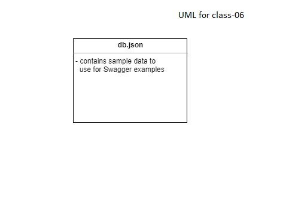

# Api-Server

A simple API (with no code) to gain some clarity and visuals on proper route structure and the data contracts.
Our API will perform CRUD operations using ReST methods on 2 data models using json-server

## Prerequisites 

- npm install -g json-server
- npm install

To run it in terminal:

`json-server -watch ./data/db.json --port 8000`

What the terminal should look like after some requests:

## Resources:

[Swagger Link](https://app.swaggerhub.com/apis/Ashjan/docs/0.1)

### UML

