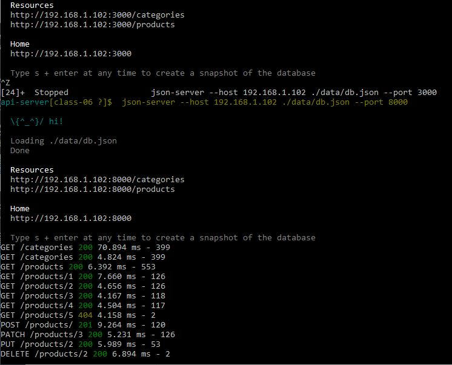
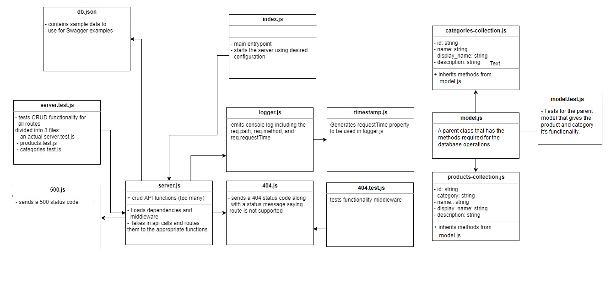

# Api-Server

A simple API (with no code) to gain some clarity and visuals on proper route structure and the data contracts.
Our API will perform CRUD operations using ReST methods on 2 data models using json-server

The App have routes to the following :

`app.post('/products', postProduct);`
`app.get('/products', getAllProducts);`
`app.get('/products/:id', getProduct);`
`app.put('/products/:id', putProduct);`
`app.delete('/products/:id', deleteProduct);`

`app.post('/categories', postCategory);`
`app.get('/categories', getAllCategories);`
`app.get('/categories/:id', getCategory);`
`app.put('/categories/:id', putCategory);`
`app.delete('/categories/:id', deleteCategory);`

## Prerequisites 

- npm install -g json-server
- npm install

For testing:
- npm test

To run it in terminal:

`json-server -watch ./data/db.json --port 8000`

What the terminal should look like after some requests:

## Technologies

- Express
- Express Router
- MongoDB (Mongoose)
- Swagger
- Jest
- Cors and Morgan

## Resources:

[Swagger Link](https://app.swaggerhub.com/apis/Ashjan/docs/0.1)
[Another Swagger Link](https://app.swaggerhub.com/apis/Ashjan/store/0.1#/)

### UML

